LABS 3 & 4 / REVISED IMPLEMENTATION

Online Local Mart System

ES6 JavaScript + Express
Product, Category, Customer and Seller

**CSEB5223 - Software Construction & Methods**
College of Computing and Informatics, UNITEN, Putrajaya Campus
Semester 1, 2026/2027 | Section 01B | Group 5

| Group member | Student ID |
| --- | --- |
| Mohamed Ali Abdelbagi Eltahir | BSW01086109 |
| Babikir Elfadil Mohamed Elfadil | BSW01085748 |
| Ahmed Yaseen Mohamed Ali Suleiman | BSW01085736 |
| Omer Hassan Ahmed Masoud Hibah | BSW01085805 |

## 1.0 System overview and scope

The Online Local Mart System (OLMS) is a planned web application for local shopping. Customers will browse products and place orders. Sellers will manage their products and stock, while administrators will manage seller approvals and product categories.

This version implements four modules: Product, Category, Customer and Seller. Each module supports creating records, displaying all records, searching, editing and confirmed deletion. The interface uses HTML and CSS. ES6 JavaScript handles the browser logic, while Express handles requests and saves data in a JSON file on the server.

The code uses simple classes, inheritance, functions, arrays, promises and separate route files. It follows the naming and documentation standards in Lab 2. The shared User and DataStore classes support the four modules; they are not extra user-facing modules.

**Current boundary:** Login, sessions, role permissions, Admin, Cart, Order and Payment are not implemented. Seller status editing is a local data-management demonstration, not an authenticated approval process. This version is intended for a single-process classroom demonstration.

All screenshots in this report were captured from the supplied Express application. The official outline gives the Labs 3 and 4 submission date as 7 October 2026, 12:00 pm.

---

## 2.0 Data, design and construction

| Class / module | Main attributes and types |
| --- | --- |
| Product | productId: number (integer); productName: string; price: number; stockQuantity: number (integer); categoryId and sellerId: number (integer). |
| Category | categoryId: number (integer); categoryName: string. |
| Customer | Inherits userId: number (integer), name: string, email: string and passwordHash: string from User. |
| Seller | Inherits the User attributes and adds accountStatus: string (Pending, Approved or Rejected). |
| Supporting classes | User provides shared identity getters/setters and updateProfile(). DataStore reads and saves the four collections. |

Product keeps the four attributes in the Lab 2 class diagram. categoryId and sellerId store its associations with Category and Seller. Seller uses the inherited userId, so Product.sellerId refers to that value. Customer and Seller extend User as planned.

Password is accepted as an input but saved as a salted hash. Public responses omit the password and hash. This is a documented refinement of the password attribute in the original design. During editing, a blank password preserves the existing hash.

| Use case | Behaviour in all four modules |
| --- | --- |
| Create | Read the form, validate it on the server, save a new record and refresh the table. |
| Search | Find an exact ID or case-insensitive text match. Show matching details or Not found. |
| Edit | Search for a target, load its details, keep the ID fixed, validate the new values and display the updated record. |
| Delete | Search for a target, show all non-secret attributes, ask for confirmation, delete and display the remaining data. |
| Display all | Load records from Express and show a clear table. Refresh the complete table after search, edit and delete. |

Models use PascalCase and matching filenames. Methods and variables use camelCase; constants use UPPER_CASE. ID names follow the Lab 2 dictionary. JavaScript uses four-space indentation, focused functions and brief comments for important logic.

---

## 3.0 Product module: create and edit

The product form accepts its ID, name, price, stock quantity, category and seller. Category 1 and approved Seller 100 were created first. The demonstration creates Jasmine Rice 5kg (ID 101, RM 25.90, stock 40) and Cooking Oil 1L (ID 102).

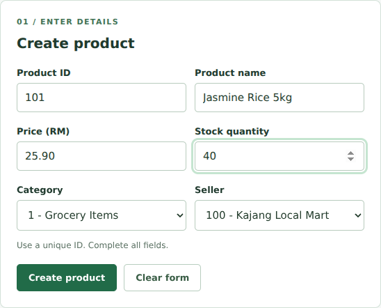

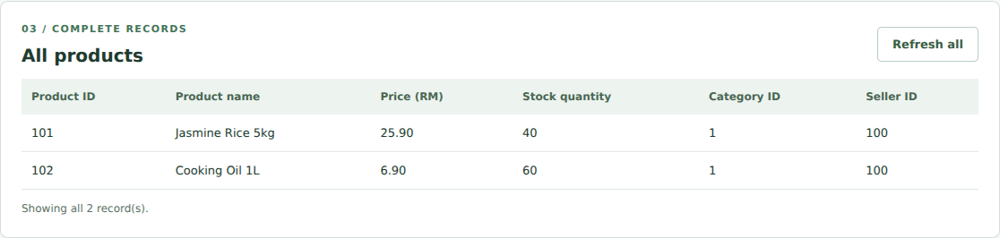

After searching ID 101 and selecting Edit, its name is changed to Premium Jasmine Rice 5kg, price to RM 27.50 and stock to 35. The ID stays fixed. A valid replacement is saved, then the complete table displays the updated values.

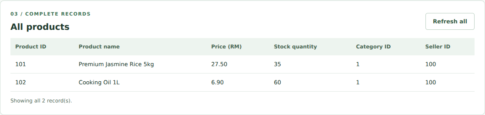

---

## 3.1 Product module: search and delete

Searching the product name with RICE returns Jasmine Rice 5kg. Searching ID 9999 shows Not found. These same results provide the Edit and Delete actions.

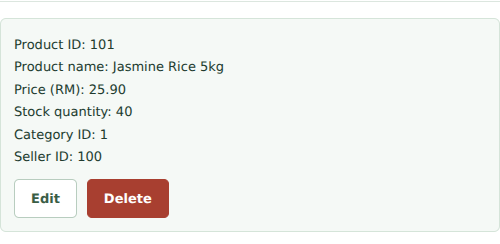

The user searches ID 102 and selects Delete. The dialog shows all six fields. Cancel keeps the product; Confirm deletion removes it. The final table contains only the edited product 101.

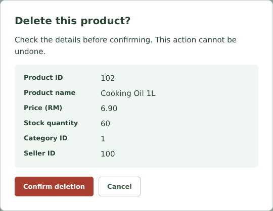

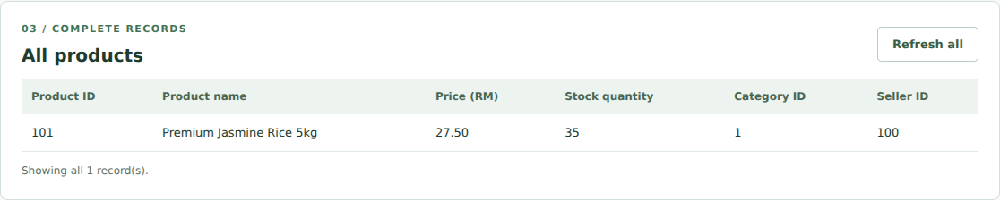

---

## 4.0 Category module: create and edit

The category form accepts categoryId and categoryName. The demonstration creates Groceries (ID 1) and Temporary Category (ID 2). IDs and category names must be unique. A category can be used when a product is created.

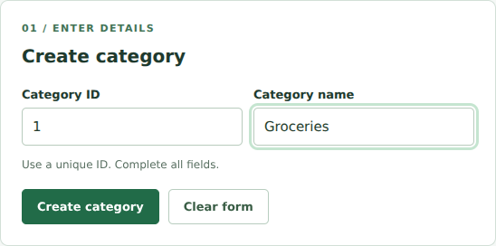

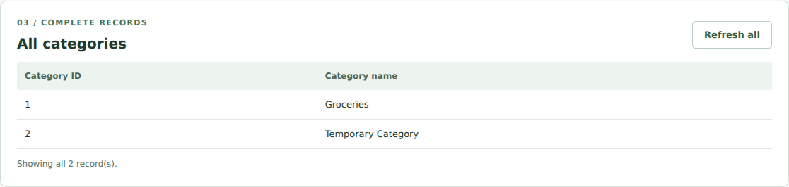

After searching ID 1 and selecting Edit, the name is changed from Groceries to Grocery Items. The existing categoryId is preserved, so products using it keep a valid reference.

---

## 4.1 Category module: search and delete

Searching the name with GROCER returns Groceries. An ID search for 9999 shows Not found. The successful result displays both attributes and the Edit and Delete actions.

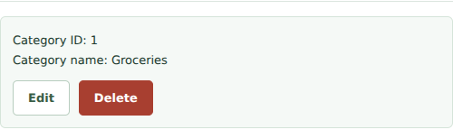

The demonstration deletes the unlinked category 2 after checking its details. Cancel leaves it unchanged; confirmation removes it. Deleting a category that is used by a product is rejected until that product is reassigned or deleted.

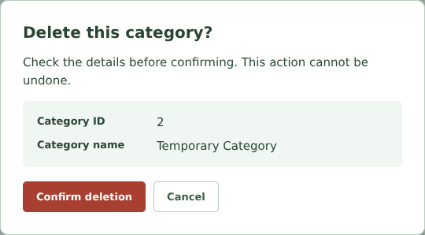

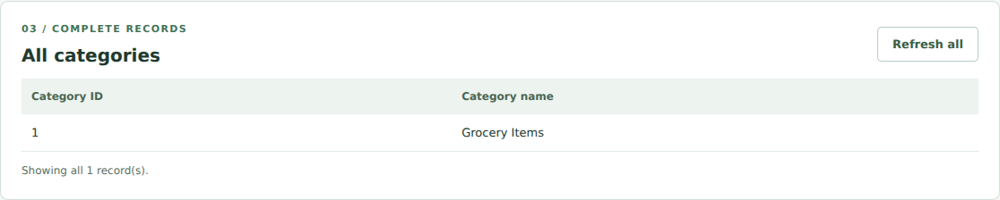

---

## 5.0 Customer module: create and edit

The customer form accepts userId, name, email and password. The demonstration creates Ali Customer (ID 300) and a temporary customer (ID 301). User IDs and email addresses must be unique across Customer and Seller.

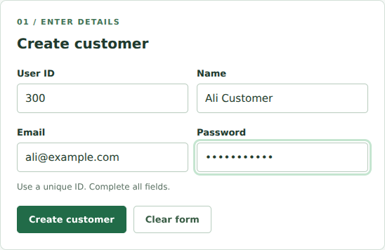

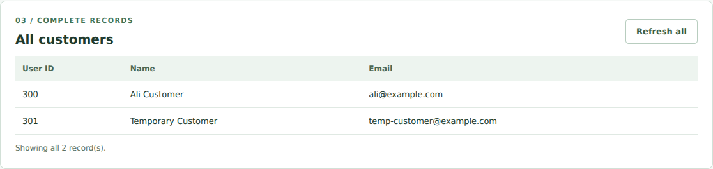

Customer 300 is edited to Ali Updated with email ali.updated@example.com. The ID stays fixed. The password field is left blank to preserve the existing hash. The table shows the updated public details without exposing credentials.

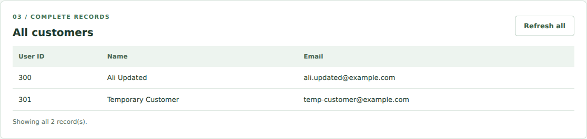

---

## 5.1 Customer module: search and delete

Searching the name with ALI returns Ali Customer. Searching ID 9999 shows Not found. Search and individual-record responses include only the public identity fields.

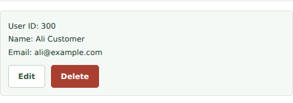

The delete dialog shows userId, name and email for customer 301. Passwords are intentionally excluded. Cancel keeps the record, and confirmation removes it. The refreshed table retains customer 300.

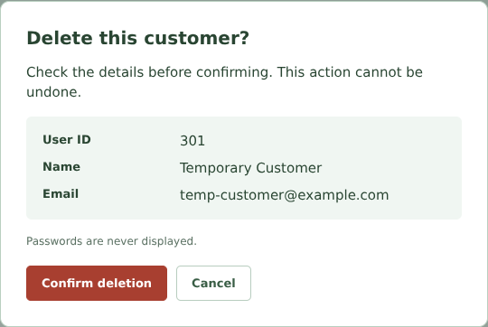

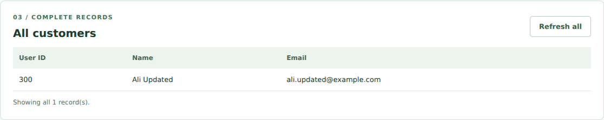

---

## 6.0 Seller module: create and edit

The seller form accepts userId, name, email, password and accountStatus. The demonstration creates Local Seller (ID 100, Approved) and Temporary Seller (ID 200, Pending). Only approved sellers can be selected for a product.

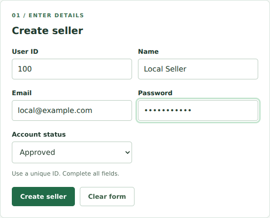

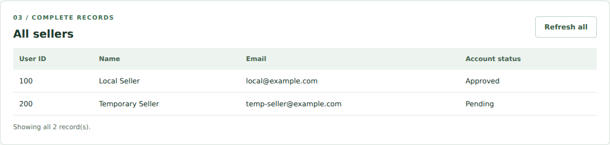

Seller 100 is edited to Kajang Local Mart with email kajang@example.com. The status remains Approved and a blank password keeps the saved hash. The table displays the updated profile and status.

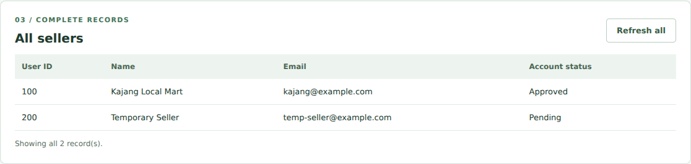

---

## 6.1 Seller module: search and delete

Searching the name with LOCAL returns Local Seller. The page also supports ID, email and status searches. Searching ID 9999 displays Not found.

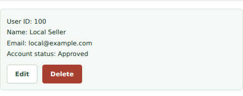

The demonstration deletes unlinked seller 200 after confirmation. Seller 100 is retained. A seller linked to a product cannot be deleted or moved away from Approved status until the product is reassigned or removed.

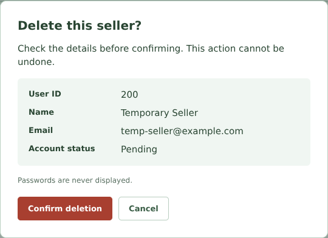

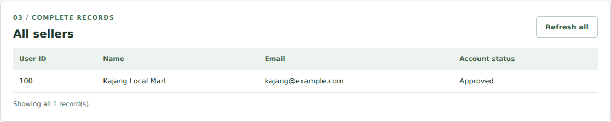

---

## 7.0 Software construction best practices

| Practice | Application and benefit |
| --- | --- |
| Naming consistency | Product.js, Category.js, Customer.js and Seller.js match their class names. productId, categoryId, userId, productName and stockQuantity follow the Lab 2 dictionary. isEditing and hasDuplicateEmail follow the Boolean convention. |
| Simple modular code | Each module has a model, an Express route file, an HTML page and a browser script. Shared checks and display functions avoid repeating common logic without adding a complex framework. |
| Object-oriented design | Customer and Seller inherit common identity behaviour from User. Getters and setters provide clear access and validation. The properties are ordinary ES6 properties, not language-enforced private fields. |
| Validation | The server checks IDs, names, email format, prices and stock. It rejects duplicates and invalid references even when requests bypass the browser form. Invalid edits do not replace the saved record. |
| Relationship integrity | A product must reference an existing category and approved seller. Deleting a linked category/seller is blocked, which prevents broken product references. |
| Clear feedback | The interface shows successful changes, search matches, not-found outputs and deletion confirmation. All tables refresh after operations. Input text is displayed with textContent. |
| Data handling | A single server-side JSON file retains records after restart. A temporary file is written before replacement. Password inputs are hashed, and public responses exclude credential data. |
| Documentation and review | The README explains scope, setup and file roles. The walkthrough explains the request flow. Tests and team review should pass before merging; branches alone do not keep main stable. |

**Feedback applied:** The interface and screenshots use light backgrounds. This report explains the system and use cases directly, keeps captions short, and uses consistent terminology. The course code is CSEB5223, following the official outline.

**Scope kept simple:** There are no frontend frameworks, TypeScript, private # fields, optional chaining or async/await in the project source. ES6 promises handle requests. Modern Node.js runs the code and Express dependencies.

---

## 8.0 Verification and submission

All 15 automated model/API tests passed. Browser checks exercised each module and captured the report screenshots. All 22 JavaScript files also passed an ES6 syntax parser check. Verification was performed on 7 October 2026.

| Verification | Observed result |
| --- | --- |
| Four CRUD lifecycles | Create, list, search, find by ID, edit and delete passed for Product, Category, Customer and Seller. |
| Unsuccessful search | ID 9999 returned no records and displayed Not found on each page. |
| Delete confirmation | Cancel preserved records; confirmation removed only the selected record and refreshed the complete table. |
| Validation and uniqueness | Invalid stock, prices, IDs and email were rejected. Duplicate IDs/emails and missing references produced client errors. |
| Relationships | Deleting an in-use category or seller was blocked. An in-use seller could not be moved away from Approved status. |
| Password handling | Salted hashes were stored. Public API responses omitted hashes/passwords. Blank editing preserved the old hash. |
| Persistence and UI | Saved values survived refresh and a fresh Express server instance. Four pages fit a 390-pixel viewport without whole-page horizontal overflow. No browser script errors were observed. |

**Run:** Use Node.js 22 or newer. From the folder containing package.json, run npm install, then npm start. Open http://localhost:3000. Run npm test to repeat the supplied automated checks. The screenshots use fictional data; the packaged working data file starts empty.

**Limitations:** This local application uses synchronous JSON storage and a single Node process. It does not provide authentication, role enforcement, a production database or full e-commerce functionality. Seller status is editable as a lab demonstration.

**GitHub and submission:** Integrate the source into the group repository, review changes and run the checks before merging. The supplied CI workflow assumes the app is at the repository root. No remote push, Actions run, protection change or submission has been performed.

**Sources:** Supplied Lab and Assignment Outline, pages 2-3; supplied Lab 2 group report; supplied README; lecturer-feedback image. Express references: <link href="https://expressjs.com/en/starter/installing/" color="#216b48">Installation</link> and <link href="https://expressjs.com/en/guide/routing/" color="#216b48">Routing</link>.
